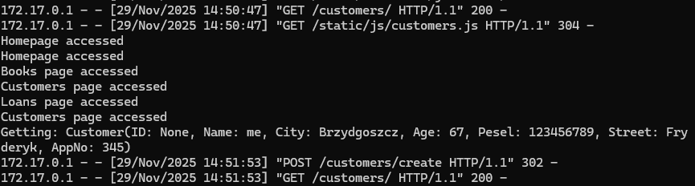
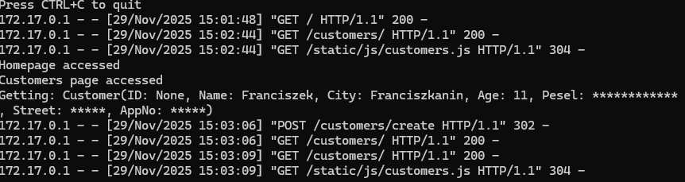

# Laboratorium 2 TBO - Logowanie & Wycieki sekretów
## Zadanie 1.
Zadanie rozpoczęto od uruchomienia aplikacji symulującej bibliotekę cyfrową (technologia Python). Następnie z wykorzystaniem komendy docker logs -f \[nazwa_kontenera\] przystąpiono do podejrzenia generowanych logów aplikacji podczas korzystania z niej. Wśród logów znaleziono podatność, która pokazywała dane osobowe dodawanych klientów. Wystąpienie podatności zarejestrowano na Zdj. 1.

Zdj. 1. Wystąpienie podatności w logach - dane personalne klientów z bazy

Taka forma logów była skutkiem wystąpienia reprezentacji obiektu klasy Customer przy jego tworzeniu (init). W celu zniwelowania podatności zmieniono formę przedstawiania nowo utworzonego obiektu Customer w jego metodzie \__repr__. Dane, które należało schować zostały zastąpione poprzez znak gwiazdki "*". Wynikiem działania było poprawne ukrywanie danych sekretnych, co widać na załączonym Zdj. 2.

Zdj. 2. Naprawienie podatności - zmiany w logach

## Zadanie 2.
W kolejnym etapie przystąpiono do zbadania historycznych commitów poprzez GIT. Użyto gitleaks, dzięki czemu historia dodawanych commitów została oceniona względem bezpieczeństwa. Wykryto przekazanie trzech sekretów w poprzednich dopisach do repozytorium. Były to klucze prywatne algorytmu szyfrowania asymetrycznego RSA. Jeśli osoba postronna dostałaby się do tej informacji, skutecznie zniwelowało by to bezpieczeństwo szyfrowanego kanału komunikacji, który mógłby zostać oparty na tych sekretach. Poniżej zamieszczono hiperłącza do zarejestrowanych podatności. W związku z powyższym wnioskować można iż nie istniały alarmy fałszywie prawdziwe po użyciu gitleaks. 

[podatnosc1-RSA-private-key](https://github.com/jarrok3/SafeSoftware02/blob/bc17b7ddc46f46fff175aed55d68e11bb48166cc/deployment.key#L1)
[podatnosc2-RSA-private-key](https://github.com/jarrok3/SafeSoftware02/blob/de9d7b8cb63bd7ae741ec5c9e23891b71709bc28/deployment2.key#L1)
[podatnosc3-RSA-private-key](https://github.com/jarrok3/SafeSoftware02/blob/bc17b7ddc46f46fff175aed55d68e11bb48166cc/awscredentials.json#L5)

## Zadanie 3.
Ostatnim zadaniem była analiza bezpieczeństwa używanych w projekcie bibliotek. W prawdziwym świecie często można napotkać wstrzyknięcia niebezpiecznych funkcji w pobieranych bilbiotekach lub/i wiele podatności w ich działaniu. Wykorzystano pakiet OWASP, który listuje znane podatności dla danych bibliotek OpenSource. Pośród znalezionych podatności wyróżniono jedną dotyczącą pakietu werkzeug w wersjach przed 2.3.8. Zawierały one podatność możliwą do wykorzystania przy atakach typu DoS. W pliku multipart.py występowała podatność, która występowała przez brak ograniczenia na przesyłanych bufferach informacji. W efekcie można było włożyć tam nadmiarowe dane i "overflowować" serwer, czyli realizować atak DoS. Inną z podatności był pakiet Jinja2 wersji 3.1.2, gdzie wykryto lukę pozwalającą obejść mechanizm sandboxa poprzez użycie filtra |attr, co może skutkować wykonaniem dowolnego kodu Pythona.
Aby doszło do wykorzystania tej podatności, atakujący musi mieć możliwość wpływu na zawartość renderowanego szablonu — dlatego w przypadku korzystania wyłącznie z szablonów deweloperskich ryzyko ataku jest niewielkie. Problem został usunięty w wydaniu 3.1.6.